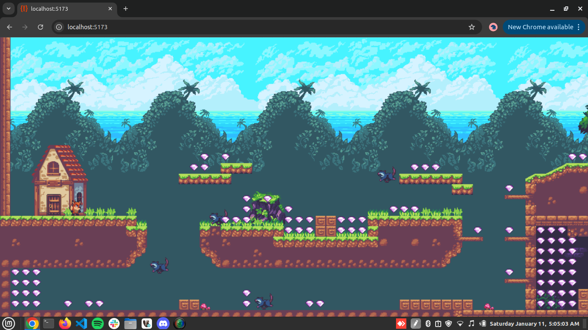
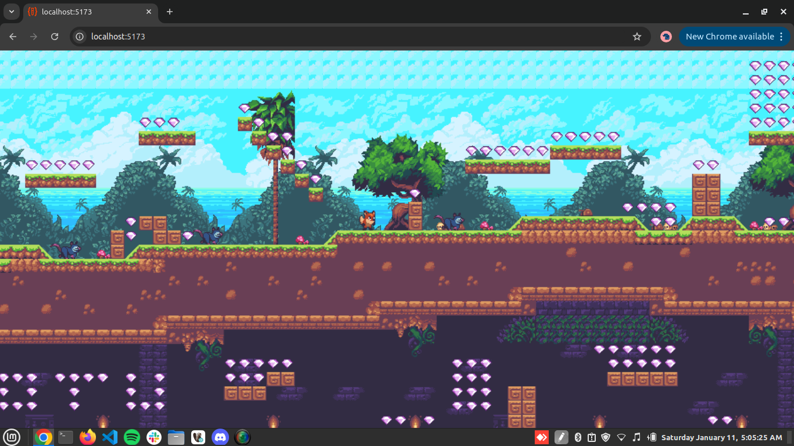
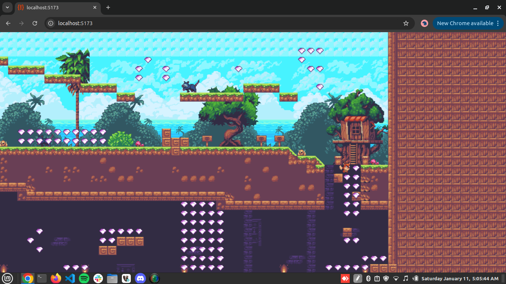
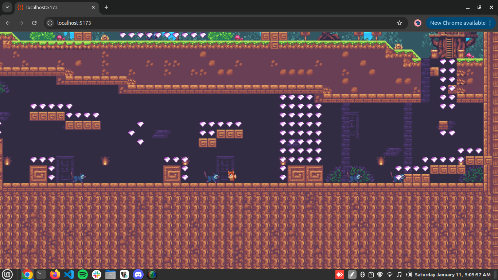

# The Rune Adventure

A 2D platform game where the player stomps on enemies and collects magical runic gems.

Controls:
- 'A' and 'D' to move left and right
- 'W' to jump
- Jump on enemies to stomp them
- Collect runic gems

[Play the game here](https://the-rune-adventure.vercel.app/)!

## Video Demo

https://github.com/pirate-sagar/the-rune-adventure/blob/main/demo/demo-video.mp4

## Screenshots

## Credits

[Game assets by ansimuz](https://ansimuz.itch.io/sunny-land-pixel-game-art)!
